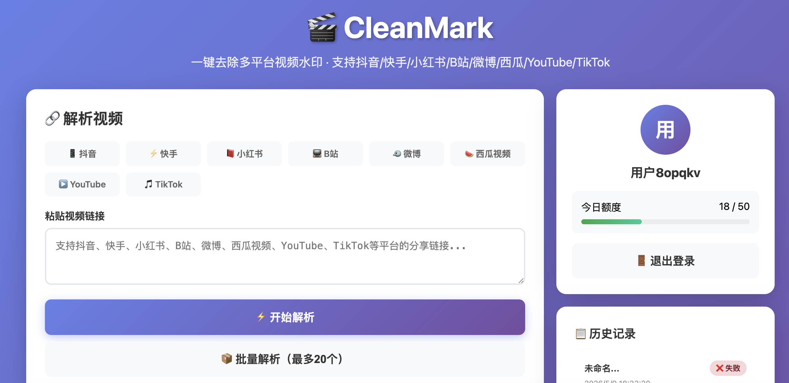
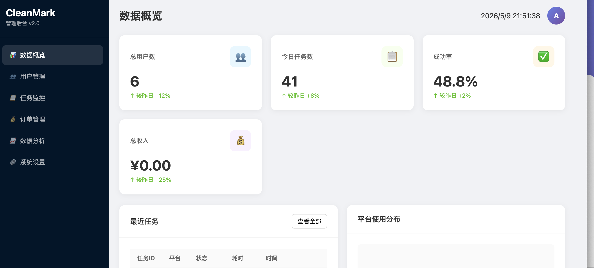

# CleanMark - 多平台视频去水印工具

<div align="center">


**一键解析多平台视频，快速去除水印**

[功能特性](#-功能特性) • [快速开始](#-快速开始) • [API文档](#-api文档) • [部署指南](#-部署指南)

</div>

***

## 📖 项目简介

CleanMark 是一个功能强大的**多平台视频/图片去水印工具**，提供Web端、管理后台和微信小程序三端支持。支持抖音、快手、小红书、B站、微博、西瓜视频、YouTube、TikTok等主流平台的一键解析和下载。

### ✨ 核心特性

#### 🎯 多平台支持

- 📱 **抖音** - 支持短视频、图集解析
- ⚡ **快手** - 支持短链接、视频解析
- 📕 **小红书** - 支持视频、图文笔记解析
- 📺 **B站** - 支持高清视频流解析
- 🐦 **微博** - 支持视频号解析
- 🍉 **西瓜视频** - 支持高清视频解析
- ▶️ **YouTube** - 支持视频下载
- 🎵 **TikTok** - 支持国际版解析

#### 🚀 技术特性

- ⚡ **极速解析** - 平均3秒内返回结果
- 🔐 **安全可靠** - JWT认证 + 限流保护
- 💾 **SQLite存储** - 轻量级数据库，零配置
- 🎨 **精美前端** - 响应式设计，支持PC/移动端
- 📊 **管理后台** - 实时监控、用户管理、数据分析
- 🔄 **批量处理** - 支持一次解析20个链接
- 💳 **支付集成** - 支持微信支付、支付宝

***

## 📸 项目截图

### 客户端界面


<br />

### 管理后台


***

## 🚀 快速开始

### 环境要求

- **Go** >= 1.21
- **操作系统**: macOS / Linux / Windows

### 安装步骤

```bash
# 1. 克隆项目
git clone https://github.com/your-username/cleanmark.git
cd cleanmark

# 2. 安装依赖
go mod tidy

# 3. 编译项目
go build -o cleanmark-server ./cmd/server

# 4. 启动服务
./cleanmark-server
```

### 访问地址

启动成功后：

- **Web界面**: <http://localhost:8080/>
- **管理后台**: <http://localhost:8080/admin/>
- **API健康检查**: <http://localhost:8080/api/v1/health>

### 默认管理员账号

- 用户名: `admin`
- 密码: `admin123`

***

## 📡 API文档

### 1. 用户认证

#### 微信登录

```bash
POST /api/v1/auth/wechat/login
Content-Type: application/json

{
  "code": "wx_code",
  "nickname": "用户昵称",
  "avatar": "头像URL"
}
```

#### 手机号登录

```bash
POST /api/v1/auth/phone/login
Content-Type: application/json

{
  "phone": "13800138000",
  "code": "123456"  // 测试验证码固定为123456
}
```

### 2. 视频解析

#### 单个解析

```bash
POST /api/v1/tasks
Authorization: Bearer {token}
Content-Type: application/json

{
  "url": "https://www.douyin.com/video/xxx",
  "quality": "hd"  // sd/hd/uhd (可选)
}
```

#### 批量解析

```bash
POST /api/v1/tasks/batch
Authorization: Bearer {token}
Content-Type: application/json

{
  "urls": [
    "https://www.douyin.com/video/1",
    "https://v.kuaishou.com/2"
  ],
  "quality": "hd"
}
```

#### 获取任务结果

```bash
GET /api/v1/tasks/{task_id}
Authorization: Bearer {token}
```

### 3. 工具接口

#### 平台检测

```bash
POST /api/v1/detect/platform
Content-Type: application/json

{
  "url": "https://www.douyin.com/video/xxx"
}
```

#### 文件下载

```bash
GET /api/v1/download/{task_id}
Authorization: Bearer {token}
```

***

## 🏗️ 项目结构

```
cleanmark/
├── cmd/server/main.go          # 程序入口
├── config/config.go            # 配置管理
├── internal/
│   ├── adapter/                # 平台适配器
│   │   ├── adapter.go          # 接口定义
│   │   ├── douyin.go           # 抖音解析
│   │   ├── kuaishou.go         # 快手解析
│   │   ├── xiaohongshu.go      # 小红书解析
│   │   ├── bilibili.go         # B站解析
│   │   ├── weibo.go            # 微博解析
│   │   ├── xigua.go            # 西瓜视频解析
│   │   ├── youtube.go          # YouTube解析
│   │   └── tiktok.go           # TikTok解析
│   ├── handler/                # HTTP处理器
│   ├── middleware/             # 中间件
│   ├── model/                  # 数据模型
│   ├── repository/             # 数据库层
│   ├── routes/                 # 路由配置
│   ├── service/                # 业务逻辑
│   └── utils/                  # 工具函数
├── web/index.html              # 客户端页面
├── admin/index.html            # 管理后台页面
├── miniprogram/                # 微信小程序
├── pkg/                        # 公共包
├── data/                       # 数据库文件
├── tests/                      # 测试文件
├── go.mod                      # Go模块
└── README.md                   # 本文档
```

***

## ⚙️ 配置说明

### 环境变量

| 变量名             | 默认值                         | 说明               |
| --------------- | --------------------------- | ---------------- |
| `SERVER_PORT`   | `:8080`                     | 服务端口             |
| `DB_PATH`       | `./data/cleanmark.db`       | SQLite数据库路径      |
| `JWT_SECRET`    | `cleanmark-secret-key-2024` | JWT密钥（生产环境必须修改！） |
| `FREE_USER_RPM` | `10`                        | 免费用户每分钟请求限制      |
| `VIP_USER_RPM`  | `60`                        | VIP用户每分钟请求限制     |
| `GLOBAL_RPM`    | `1000`                      | 全局每分钟请求限制        |

### 生产环境配置

```bash
# 生产环境配置示例
export SERVER_PORT=:8080
export DB_PATH=/var/data/cleanmark.db
export JWT_SECRET="your-super-secret-key-here"
export FREE_USER_RPM=5
export VIP_USER_RPM=120
```

***

## 🛠️ 开发指南

### 添加新平台支持

1. 在 `internal/adapter/` 创建新的适配器文件

```go
// example: new_platform.go
type NewPlatformAdapter struct{}

func (n *NewPlatformAdapter) Name() string { 
    return "新平台" 
}

func (n *NewPlatformAdapter) Parse(ctx context.Context, url string) (*VideoInfo, error) {
    // 实现解析逻辑
}

func (n *NewPlatformAdapter) SupportedDomains() []string {
    return []string{"newplatform.com"}
}
```

1. 在 `adapter.go` 的 `GetAdapter()` 函数中注册
2. 更新 `utils.DetectPlatform()` 和前端平台列表

### 运行测试

```bash
# 运行所有测试
go test ./tests/...

# 运行特定测试
go test ./tests/admin_test.go
```

***

## 📈 部署指南

### 使用 Docker

```bash
# 构建镜像
docker build -t cleanmark:latest .

# 运行容器
docker run -d -p 8080:8080 cleanmark:latest
```

### 使用 Nginx 反向代理

```nginx
server {
    listen 80;
    server_name your-domain.com;
    
    location / {
        proxy_pass http://127.0.0.1:8080;
        proxy_set_header Host $host;
        proxy_set_header X-Real-IP $remote_addr;
        proxy_set_header X-Forwarded-For $proxy_add_x_forwarded_for;
    }
}
```

### 使用 Systemd

```bash
# 创建服务文件
sudo nano /etc/systemd/system/cleanmark.service

# 启动服务
sudo systemctl start cleanmark
sudo systemctl enable cleanmark
```

***

## 🔒 安全注意事项

⚠️ **生产环境必做**:

1. **修改JWT密钥**
   ```bash
   export JWT_SECRET="$(openssl rand -base64 32)"
   ```
2. **启用HTTPS**
   - 使用Let's Encrypt免费证书
   - 配置SSL终止
3. **限制CORS**
   - 修改routes.go中的CORS配置
4. **定期备份数据库**
   ```bash
   crontab -e
   # 添加定时备份
   0 2 * * * cp data/cleanmark.db backup/cleanmark_$(date +%Y%m%d).db
   ```

***

## ❓ 常见问题

### Q: 解析失败怎么办？

A:

1. 检查链接是否正确（确保是分享链接）
2. 查看平台是否在支持列表中
3. 查看日志确认错误原因

### Q: 如何提高每日限额？

A:

- 免费用户：每日3次
- 可通过管理后台修改用户VIP等级提升限额

### Q: 支持哪些平台？

A:
目前支持：

- ✅ 抖音
- ✅ 快手
- ✅ 小红书
- ✅ B站
- ✅ 微博
- ✅ 西瓜视频
- ✅ YouTube
- ✅ TikTok

***

## 📄 许可证

MIT License

Copyright (c) 2024 CleanMark

***

## 🤝 贡献指南

欢迎提交Issue和Pull Request！

1. Fork本项目
2. 创建特性分支 (`git checkout -b feature/amazing-feature`)
3. 提交更改 (`git commit -m 'Add amazing feature'`)
4. 推送到分支 (`git push origin feature/amazing-feature`)
5. 开启Pull Request

***

## 🙏 致谢

感谢以下开源项目：

- [Gin](https://github.com/gin-gonic/gin) - Web框架
- [GORM](https://gorm.io/) - ORM框架
- [GJSON](https://github.com/tidwall/gjson) - JSON解析

***

<div align="center">

**Made with ❤️ by CleanMark Team**

⭐ 如果这个项目对你有帮助，请给一个Star支持一下！ ⭐

</div>
